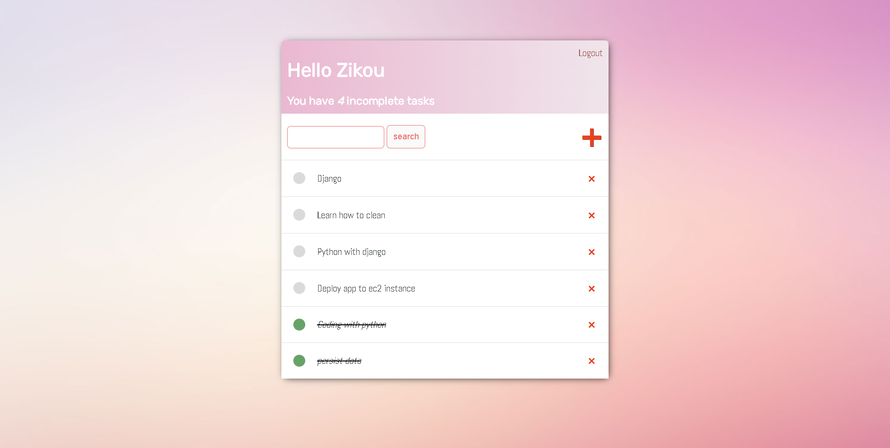

# Project README
This project is a pipeline implemented using Jenkins to provision an EC2 instance on AWS, build a Docker image of a Django application, push the image to Amazon Elastic Container Registry (ECR), and deploy the application to the provisioned EC2 instance using Ansible.

## Pipeline Overview
The pipeline consists of the following stages:

1. Provision EC2 instance:

    This stage provisions an EC2 instance on AWS using Terraform. It initializes Terraform and applies the configuration to create the EC2 instance. The public IP address of the provisioned instance is stored in the MY_IP variable.
2. Build Docker image:

    In this stage, the pipeline sets the IP address of the provisioned EC2 instance in the allowed_host configuration of the Django application's settings.py file. It then builds a Docker image of the Django application using the specified build number.
3. Push Image to ECR:

    This stage authenticates with AWS using the provided credentials and pushes the built Docker image to Amazon ECR. It tags the image with the build number before pushing.
4. Deploy app to provisioned server:

    The final stage deploys the Django application to the provisioned EC2 instance using Ansible. It waits for the SSH connection to be available and then installs Docker, Docker Compose, and other necessary dependencies on the server. It logs in to the Docker registry, pulls the Docker image with the specified build number, and prepares the application for deployment.

The image above reflects the successful deployment of the Django application, showcasing the seamless execution of the pipeline from provisioning the infrastructure to the smooth functioning of the deployed application.
\
\
\

